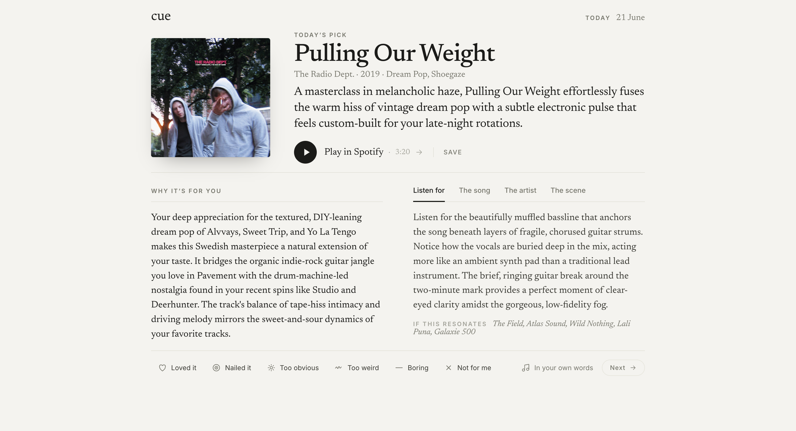
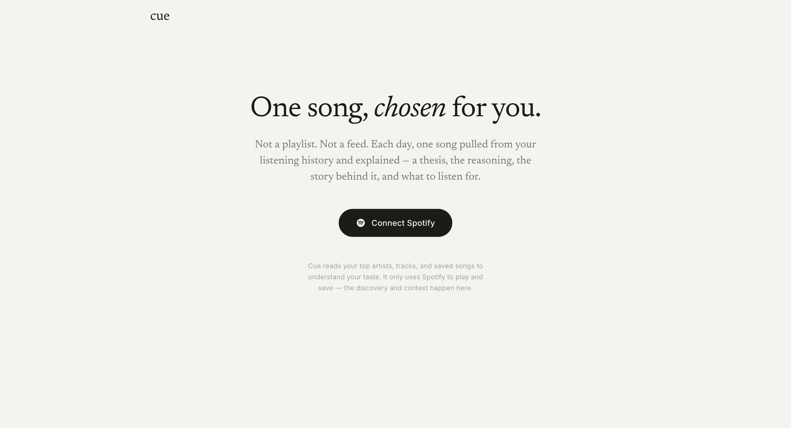

# Cue

**One song a day, chosen for you — and explained.** Cue reads your Spotify listening, picks a single track, and writes the liner notes: a one-line thesis, why it fits *you*, what to listen for, and the story behind it. Not a playlist. Not a feed. One song that matters.



## How it works

1. **Connect Spotify.** Cue reads your top artists, tracks, saved songs, and recent plays to build a taste profile.
2. **Gemini picks one song.** It's prompted with your taste — plus what you've already seen and how you've reacted — and returns a single structured recommendation.
3. **The pick is grounded in reality.** Cue finds the exact track on Spotify and uses the real art, year, duration, and link. If it can't verify the track, it shows the writeup with a search link rather than faking metadata.
4. **You react.** Loved it · Nailed it · Too obvious · Too weird · Boring · Not for me — or say it in your own words. Your reaction steers the next pick.

Everything lives in your browser tab. Cue stores nothing server-side, so reloading starts you fresh.



## Run it locally

You'll need Node 20+ and the [Infisical CLI](https://infisical.com/docs/cli/overview). Secrets live in Infisical — no `.env` to chase down.

```bash
npm install
infisical login   # pick the BidLab org
npm run dev        # pulls secrets from Infisical and starts on :8888
```

Open **http://127.0.0.1:8888** — use `127.0.0.1`, not `localhost`, or Spotify's OAuth redirect won't match.

No Infisical access? Copy `.env.example` to `.env.local`, fill it in, and run `npm run dev:local` instead.

| Variable | What it is |
| --- | --- |
| `GEMINI_API_KEY` | Google AI Studio key — https://aistudio.google.com/apikey |
| `GEMINI_MODEL` | Model id (default `gemini-3.5-flash`) |
| `SPOTIFY_CLIENT_ID` / `SPOTIFY_CLIENT_SECRET` | From your Spotify app — https://developer.spotify.com/dashboard |
| `SPOTIFY_REDIRECT_URI` | `http://127.0.0.1:8888/callback` (must match the app exactly) |
| `APP_BASE_URL` | `http://127.0.0.1:8888` |

## Stack

- **Next.js** on **Cloudflare Workers** (via `@opennextjs/cloudflare`).
- **Google Gemini** for the recommendation, returned as structured JSON via a response schema.
- **Spotify Web API** (Authorization Code flow) to read taste, verify the track, and save it to your library.

## Good to know

- The Spotify app runs in **development mode**, so only accounts you've added can connect — fine for sharing with a few friends.
- **Playback isn't built in** — "Play in Spotify" opens the track in Spotify, which works for free and Premium alike.
- Taste comes from artists, tracks, genres, and eras, since Spotify retired its audio-features and recommendations endpoints for new apps.
- The writeup is editorial prose from an LLM. The song is grounded against real Spotify data, but treat the backstory as commentary, not citation.
